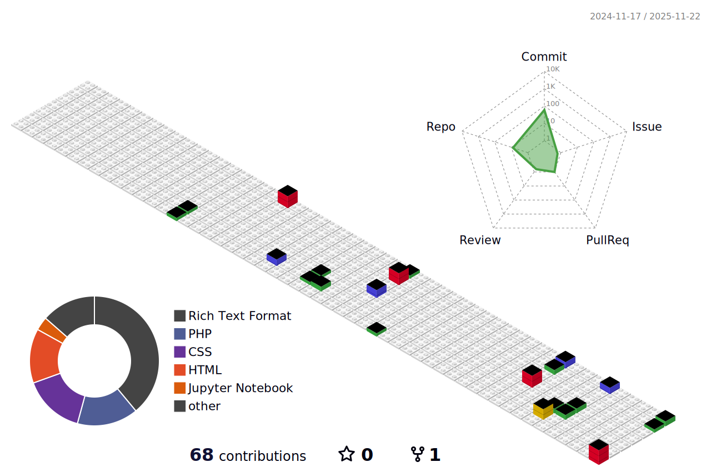

<h1 align="center">Isaque Carlos </h1>

  Desenvolvedor Full Stack 

---

<!--  -->

---

## Sobre

- Atuação em desenvolvimento full stack com JavaScript e PHP
- Cursando Tecnplogia em Sistemas para Internet no Senac

## Projetos em destaque

- [CRUD Clinica Estetica](https://github.com/IsaqueCarlos28/Projeto-PI---TSI---2--semestre-) – CRUD para clinica de Estética
- [JAS Rede Cidada ](https://github.com/IsaqueCarlos28/Projeto-JAS) – Landing Page para projeto JAS da Rede Cidadã
- [POKE -API](https://github.com/IsaqueCarlos28/apiPokemon) – Atividade acadêmica de consumo de API 

## Contato

- [LinkedIn](www.linkedin.com/in/isaque-carlos-da-silva-melo-3492181a2)
<!-- - [Suporte de Domingo](https://suportededomingo.com.br/)
- [Portfólio](https://professorcorrea.com.br/) 
- [Instagram - Professor Corrêa](https://www.instagram.com/professorcorrea)-->

---

> Sempre buscando Aprender!!
